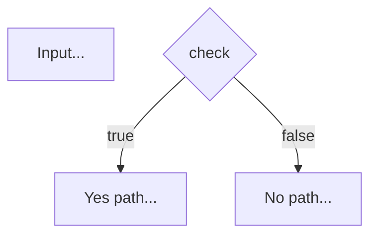

# Prompt Weaver 🧵

> 轻量级 Prompt 编排引擎 - 零依赖，快速原型

## 概念

类似 Unix pipe 的哲学：每个节点做一件事，做好它，然后通过管道组合成复杂工作流。

```
Input → [Prompt] → [Transform] → [Condition] → Output
```

## 特性

- ✅ **零依赖核心** - 只用 Python 标准库
- ✅ **链式 API** - 流畅的构建器模式
- ✅ **条件分支** - 支持动态路由
- ✅ **内置过滤器** - upper, lower, length, split, join...
- ✅ **自定义扩展** - 轻松添加转换器
- ✅ **Mermaid 图** - 可视化工作流
- ✅ **YAML 配置** - 声明式定义
- ✅ **子工作流** - 嵌套调用工作流
- ✅ **Map-Reduce** - 批量处理模式
- ✅ **模板缓存** - 性能优化
- ✅ **JSON 导入/导出** - 工作流序列化与共享
- ✅ **CLI 工具** - 完整命令行支持（run/render/export/import/validate/mermaid）
- ✅ **工作流验证** - 检查节点引用、可达性
- ✅ **生命周期钩子** - before_node/after_node/on_error 事件监听
- ✅ **执行指标** - 节点耗时、重试次数、状态追踪
- ✅ **迭代优化** - refine 节点，自动收敛检测

## 快速开始

### 1. 简单模板渲染

```python
from weaver import weave

result = weave("Hello, {{name}}!", {"name": "World"})
# => "Hello, World!"
```

### 2. 链式 API

```python
from weaver import Chain

chain = (Chain()
    .prompt("Hello, {{name}}!")
    .transform("upper")
    .output())

ctx = chain.run({"name": "World"})
print(ctx.current_output)  # => "HELLO, WORLD!"
```

### 3. 条件分支

```python
from weaver import PromptWeaver

weaver = PromptWeaver()
weaver.add_prompt("start", "Score: {{score}}", next_node="check")
weaver.add_condition("check", lambda ctx: ctx.get("score") >= 60, "pass", "fail")
weaver.add_prompt("pass", "🎉 You passed!")
weaver.add_prompt("fail", "😢 Try again!")

ctx = weaver.run({"score": 85})
print(ctx.current_output)  # => "🎉 You passed!"
```

### 4. YAML 工作流

```yaml
# workflow.yaml
- id: greet
  type: prompt
  template: "Hello, {{name | upper}}!"
  next: output

- id: output
  type: output
  key: result
```

```bash
python -m weaver.cli run workflow.yaml --var name=Alice
```

## 内置过滤器

| 过滤器 | 功能 | 示例 |
|--------|------|------|
| `upper` | 大写 | `{{name \| upper}}` |
| `lower` | 小写 | `{{name \| lower}}` |
| `trim` | 去除空格 | `{{text \| trim}}` |
| `length` | 长度 | `{{items \| length}}` |
| `split` | 分割 | `{{text \| split}}` |
| `join` | 连接 | `{{words \| join}}` |
| `first` | 第一个 | `{{list \| first}}` |
| `last` | 最后一个 | `{{list \| last}}` |
| `json` | JSON 序列化 | `{{data \| json}}` |

## 自定义转换器

```python
from weaver import PromptWeaver

weaver = PromptWeaver()
weaver.register_transformer("reverse", lambda x: x[::-1])

chain = (Chain()
    .prompt("{{text}}")
    .transform("reverse")
    .output())

ctx = chain.run({"text": "hello"})
print(ctx.current_output)  # => "olleh"
```

## 节点类型

### Prompt 节点
渲染模板，支持变量和过滤器。

```python
weaver.add_prompt("greet", "Hello, {{name}}!")
```

### Condition 节点
条件分支，支持函数或字符串表达式。

```python
# 使用函数
weaver.add_condition("check", lambda ctx: ctx.get("age") >= 18, "adult", "minor")

# 使用字符串表达式
weaver.add_condition("check", "{{score}} >= 60", "pass", "fail")
```

### Transform 节点
数据转换管道。

```python
weaver.add_transform("process", ["lower", "trim", "split"])
```

### Output 节点
输出结果到上下文。

```python
weaver.add_output("result", key="final_output")
```

### Subworkflow 节点
嵌套调用另一个 PromptWeaver 工作流。

```python
# 创建子工作流
sub = PromptWeaver()
sub.add_prompt("process", "{{input | upper}}")
sub.add_output("sub_end")

# 主工作流调用
weaver.add_subworkflow("call_sub", sub,
                       input_mapping={"text": "name"},
                       output_key="processed")
```

### Map-Reduce 节点
批量处理模式 - Map 阶段对每个元素应用模板，Reduce 阶段合并结果。

```python
# Map: 对每个名字生成问候语
# Reduce: 用换行符连接
weaver.add_map_reduce("greet_all", "{{names}}", "name", "Hello, {{name}}!",
                      reduce_strategy="join")
```

Reduce 策略：
- `join` - 用换行符连接
- `concat` - 直接拼接
- `sum` - 数值求和
- `first/last` - 取首/尾
- 自定义函数 - `lambda xs: " | ".join(xs)`

## 示例场景

### 1. AI Agent 任务解析

```yaml
- id: parse
  type: prompt
  template: "Task: {{user_input}}"
  next: classify

- id: classify
  type: condition
  condition: "{{user_input | lower}} contains 'create'"
  true: create_handler
  false: query_handler

- id: create_handler
  type: prompt
  template: "📝 Creating new item..."
  next: output

- id: query_handler
  type: prompt
  template: "🔍 Searching..."
  next: output

- id: output
  type: output
  key: task_result
```

### 2. 数据处理管道

```python
from weaver import Chain

pipeline = (Chain()
    .prompt("{{raw_data}}")
    .transform("lower", "trim", "split")
    .transform("length")
    .output())

ctx = pipeline.run({"raw_data": "  ONE TWO THREE  "})
print(ctx.current_output)  # => 3 (单词数)
```

### 3. 智能评分系统

```yaml
- id: input
  type: prompt
  template: "Student: {{name}}, Score: {{score}}"
  next: check

- id: check
  type: condition
  condition: "{{score}} >= 90"
  true: excellent
  false: check_pass

- id: check_pass
  type: condition
  condition: "{{score}} >= 60"
  true: pass
  false: fail

- id: excellent
  type: prompt
  template: "🏆 {{name}} is excellent!"
  next: output

- id: pass
  type: prompt
  template: "👍 {{name}} passed!"
  next: output

- id: fail
  type: prompt
  template: "📚 {{name}} needs to study more."
  next: output

- id: output
  type: output
  key: evaluation
```

### 4. 子工作流 - 模块化处理

```python
# 可复用的数据处理模块
data_processor = PromptWeaver()
data_processor.add_prompt("clean", "{{input | trim | lower}}")
data_processor.add_transform("tokenize", ["split"])
data_processor.add_output("processed")

# 主工作流 - 批量处理
main = PromptWeaver()
main.add_prompt("start", "Processing {{count}} items")
main.add_subworkflow("process_1", data_processor,
                     input_mapping={"text": "item1"},
                     output_key="result_1")
main.add_subworkflow("process_2", data_processor,
                     input_mapping={"text": "item2"},
                     output_key="result_2")
main.add_output("final")

# 复用同一个数据处理流程处理多个输入
```

### 5. Map-Reduce - 批量任务生成

```python
from weaver import PromptWeaver

weaver = PromptWeaver()

# 批量为团队生成周报摘要
weaver.add_map_reduce(
    "generate_summaries",
    "{{team_tasks}}",              # 变量: ["Task A", "Task B", "Task C"]
    "task",                       # 循环变量
    "- {{task}} completed this week",  # Map 模板
    reduce_strategy="join"        # Reduce: 换行连接
)

weaver.add_output("result")
weaver.start_node = "generate_summaries"

ctx = weaver.run({
    "team_tasks": [
        "API design",
        "Frontend development",
        "Testing and bug fixes"
    ]
})

# 输出:
# - API design completed this week
# - Frontend development completed this week
# - Testing and bug fixes completed this week
```

## 可视化

生成 Mermaid 流程图：

```python
from weaver import PromptWeaver

weaver = PromptWeaver()
weaver.add_prompt("start", "Input")
weaver.add_condition("check", lambda ctx: True, "yes", "no")
weaver.add_prompt("yes", "Yes path")
weaver.add_prompt("no", "No path")

print(weaver.to_mermaid())
```

输出：



## CLI 使用

```bash
# 运行工作流
python -m weaver.cli run workflow.yaml --var name=World

# 快速渲染
python -m weaver.cli render "Hello, {{name}}!" --var name=World

# 生成流程图
python -m weaver.cli mermaid workflow.yaml

# 运行演示
python -m weaver.cli demo
```

## 架构

```
prompt-weaver/
├── weaver/
│   ├── __init__.py      # 导出
│   ├── engine.py        # 核心引擎
│   └── cli.py           # 命令行工具
├── examples/            # 示例工作流
│   ├── greeting.yaml
│   ├── score-evaluator.yaml
│   └── agent-task-parser.yaml
├── tests/
│   └── test_engine.py   # 测试套件
└── README.md
```

## 设计原则

1. **单一职责** - 每个节点只做一件事
2. **可组合** - 节点可以任意组合
3. **透明** - 每一步都可见（历史记录）
4. **轻量** - 核心零依赖

## 与现有工具对比

| 特性 | Prompt Weaver | LangChain | n8n |
|------|---------------|-----------|-----|
| 依赖 | 0 | 多 | 多 |
| 学习曲线 | 5 分钟 | 数小时 | 数小时 |
| 用例 | 快速原型 | 生产级 | 可视化 |
| AI 集成 | 模板 | 深度 | 中等 |
| 子工作流 | ✅ | ✅ | ✅ |
| Map-Reduce | ✅ | 需扩展 | 复杂 |

## 使用场景

- ✅ AI Agent 工具快速原型
- ✅ Prompt 模板管理
- ✅ 数据处理管道
- ✅ 工作流编排
- ✅ 教学和演示

## License

MIT

---

**Created in Code Lab - 2026-03-26**

*专注于 AI Agent 工具、嵌入式 AI、快速原型开发*
